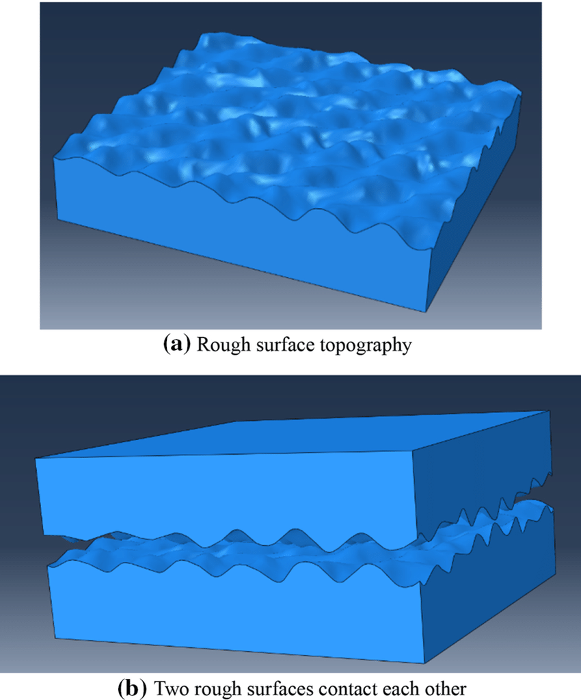
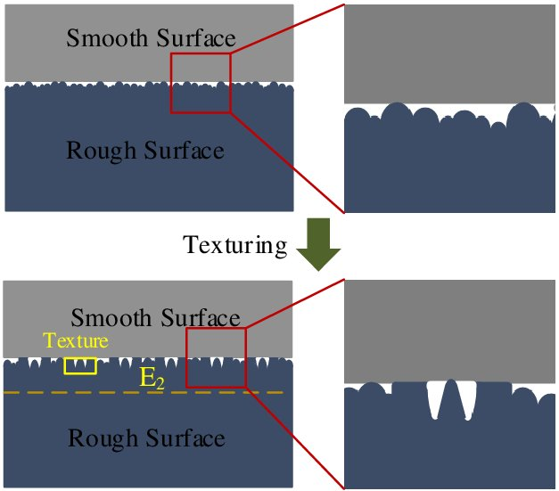
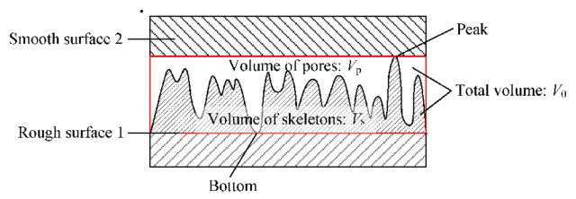

- fix week3 notebook
- random surface script
- C++ start-up, *FFTW*
- C++ implement two algorithm(gradient decent, conjugate gradient)
- viscoelastic script

since we can generate a random surface, I would like to use this random surface to compute its displacement under a constant loading, maybe later we can add an instant loading. So the solver that we can apply is the C++ version in week3, because the python version based on scipy library is too slow, I tested it on my Macbook, it takes more than 13 mins(and i have to crush it).

In this step, we can flat and rondom rough surfaces, domain decomposition and mpi?

But it sounds too trivally, the random surface that we generate will have "mountains" and "vallies", how could we analysis its deformation, how can we track its deformation? And not all surfaces have simple "uniformly" parabolic configuration, some may show adhesive behavior.

is this volume integral??

dynamic approching for two rough surfaces? Or they are already contact then we apply loading and see its evolution?

first contact creteria for two rough surfaces

## Reference:

[1] https://www.researchgate.net/publication/354650367_Theoretical_and_Experimental_Study_on_Normal_Contact_Stiffness_of_Plane_Joint_Surfaces_with_Surface_Texturing

[2] https://www.researchgate.net/publication/354239444_Mechanics_Analysis_of_Rough_Surface_Based_on_Shoulder-Shoulder_Contact