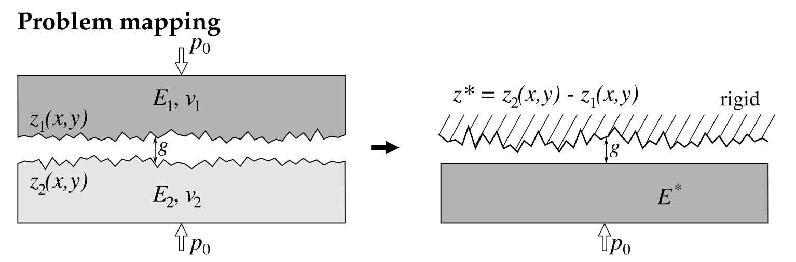

### Project Summary

**Title**: Contact Problem Solver between Rigid Sphere and Random Rough Elastic Surface

**Description**: This project aims to develop a solver in C++ to simulate and analyze the contact problem between a rigid sphere and a randomly generated rough elastic surface. The solver will focus on efficiently handling 2D data arrays, generating random rough surfaces, calculating displacements upon contact, and visualizing the results.

Concerning our master thesis topic, we want to  develop a solver to simulate the evolution of contact between two random rough viscoelastic surfaces. For normal elastic contact, we can simplify our model as follow:

We know that may also validate for viscoelastic materials with the same time-scale.

### Components

1. **2D Array Management**
   - **Purpose**: In /Week3,        To efficiently store and access two-dimensional data representing the rough surface's topography.
   - **Implementation**: A class dedicated to 2D array operations, including memory management and element access.
   - **Expansion**: mdspan, Eigen

2. **Random Surface Generation**
   - **Purpose**: To generate a random, rough surface that the rigid sphere will contact, simulating realistic scenarios.
   - **Implementation**: A class responsible for creating the surface using algorithms suitable for generating roughness and randomness.

3. **Complementary Energy Minimization**
   - **Purpose**:
   - **Implementation**:

4. **Main Application Logic (main.cc)**
   - **Purpose**: To bring together the 2D array management and random surface generation functionalities. It will simulate the contact problem, calculate displacements, and handle the visualization of both the surface and the results of the contact analysis.
   - **Implementation**:

5. **Result Visualization**
   - **Purpose**: To visualize our random surface and dispalcment field and comparation with analytical solution
   - **Implementation**: With python script *Result_visualization.py*

### Key Features

- Modular C++ design for easy maintenance and scalability.
- FFTW library
- Eigen library
- mdspan for C++23, Efficient 2D data handling for large datasets.
- Realistic random surface generation for accurate simulation of roughness.
- Visualization of the rough surface and displacement results.

